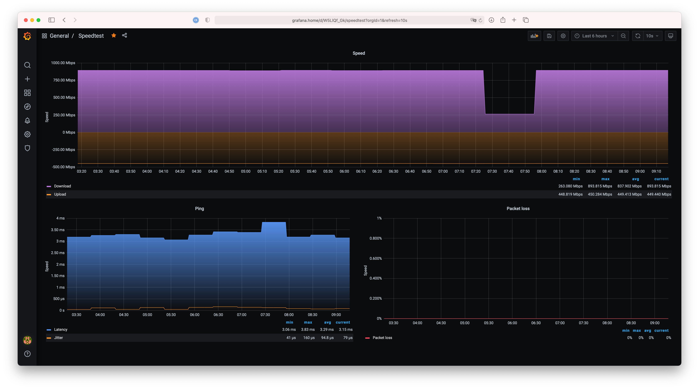

# speedtest-exporter

Exports [Speedtest CLI](https://www.speedtest.net/apps/cli) metrics in the Prometheus format, caching the results.



This fork encompasses the follow design changes from upstream:

- Use fewer dependencies to help minimise binary size
- Automated testing to verify behaviour
- Only support running using container images rather than apt, yum, etc.
- Remove support for including server labels in metrics as that'd contain too much entropy for a Prometheus metric

## Links

- [Grafana Dashboard](https://grafana.com/grafana/dashboards/14187)

## Running

```sh
docker run --rm -p 9876:9876 wjam/speedtest-exporter
```
